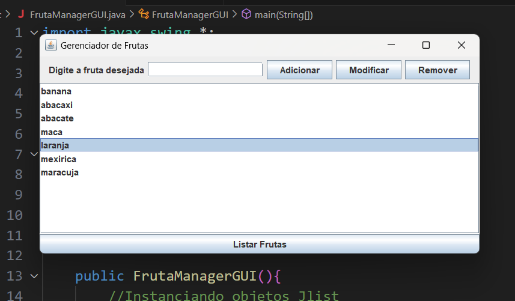

# GERENCIAMENTO DE FRUTAS GUI

Este programa se compõe de um sistema de gerenciamento de frutas, onde é possível adicionar, remover, modificar e listar as frutas presentes dentro do ArrayList defaultModelList usando uma interface gráfica com botões, que cada um possuem as funções listadas anteriormente.
## 🚀 Começando

ETAPA 1

CRIE UM PROJETO JAVA PARA MESCLAR OS CONHECIMENTOS SOBRE O USO DE ARRAY E DE INTERFACES;

PARA ISSO CONSTRUA UM CÓDIGO QUE TENHA UM INTERFACE E QUE REALIZE AS OPERAÇÕES ENCONTRADAS NO PROJETO DE GERENCIAMENTO DE FRUTAS;

DURANTE O DESENVOLVIMENTO COMENTE O CÓDIGO CRIADO;

PARA ENTREGA CRIE UM REPOSITÓRIO REMOTO COM TÍTULO: GERENCIAMENTO_FRUTAS_GUI;

AO TÉRMINO CRIE O README.MD DO PROJETO, TIRE UM PRINT DO CONSOLE COM PROJETO FUNCIONANDO E INSIRA NO README.
### 📋 Pré-requisitos

De que coisas você precisa para instalar o software e como instalá-lo?

```
.
```

### 🔧 Instalação

* Usuário precisa digitar o nome de alguma fruta para ser adicionada, se ele selecionar alguma fruta da lista, o usuário poderá modificar ou remover a fruta selecionada, também tem a opção de listar as frutas presentes na lista.

## 🛠️ Construído com

Ferramentas utilizadas e bibliotecas

* VS CODE

## 📌 Versão

* **Versão 1.0** 

## ✒️ Autores

* **João Henrique Santos da Silva** - *Trabalho Inicial* - Gerencimento de frutas GUI

## Terminal do gerenciamento de tela GUI
* **Console do GUI**



